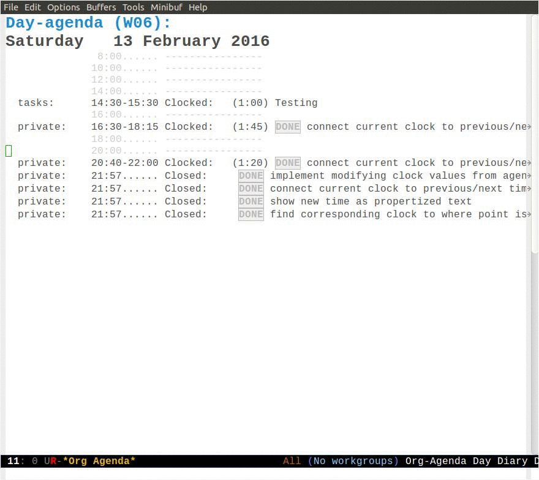

# org-clock-convenience

This is a collection of functions I am writing in order to make my
clocking work-flows easier.

My aim is to do as much of the clocking from the agenda buffer
without ever having to leave it, except to open a new task.

<h2>Table of Contents</h2>

<ul>
<li><a href="#orgd961196">1. org-clock-convenience</a></li>
<li><a href="#org551d8f5">2. Motivation</a></li>
<li><a href="#orgc00d1ba">3. Interactive functions</a></li>
<li><a href="#org02543bd">4. Installation</a>
<ul>
<li><a href="#org783318e">4.1. basic installation and configuration</a></li>
<li><a href="#orge1cbddb">4.2. installation and configuration by <b>use-package</b></a></li>
<li><a href="#orgaec1e99">4.3. Tip: using helm for efficiently clocking into tasks</a></li>
</ul>
</li>
<li><a href="#org9ad4bb7">5. Current shortcomings</a></li>
</ul>

# Motivation

It happens quite often that I get distracted by other tasks, e.g. a
colleague involving me in a longer discussion, while I am still
clocked in to the previous task. So, frequently I need to adapt the
clock history to fill gaps or to correct for tasks happening when I
was not in front of the screen. I want to have my whole day clocked
seamlessly, and I have done so over the last 4 years using Org.
Formerly, this involved a lot of jumping to the clock lines of org
files to adapt the timestamps, which is cumbersome and needs time.

I always wanted to have commands with which I can change the clock
values directly **from the log lines in the agenda view** in the same
way that one can change timestamps under the cursor inside of an org
file using `org-timestamp-up` and `org-timestamp-down` (usually
mapped to `<S-up>` and `<S-down>`).

# Interactive functions

-   `org-clock-convenience-timestamp-up` and `org-clock-convenience-timestamp-down`:
    When on a *clocked* line in the agenda buffer, this function will
    increase/decrease the time according to the position of the
    cursor. If the cursor is on the hour field, change the hour. If it
    is on the minutes field, change the minutes. Undo works on the
    agenda and on the source buffer.
-   `org-clock-convenience-fill-gap` modifies the timestamp at point to
    connect to the previous/next logged time range.
-   `org-clock-convenience-fill-gap-both` connects both timestamps of
    the current clock log line at point to fill the interval between
    the previous and the next clock range. The cursor need not be on a
    timestamp of the line. This is the most efficient way to fill the
    interval for a forgotten task.
-   `org-clock-convenience-goto-ts` goto the associated timestamp in the org
    file. Position the cursor respective to where the cursor was
    placed in the agenda view (e.g. on the minutes part of the
    starting time).
-   `org-clock-convenience-goto-last-clockout`: goto timestamp of the last
    clockout (this is based on a real search through the buffer and
    not based on the saved clockout value).

Note that the agenda clock changing commands work with **undo** in the
same way as other org agenda commands. They will undo in the agenda
buffer as well as in the org source buffers. But if the agenda
buffer is rebuilt after a change (e.g. by `g`), the undo information
is lost.

The package also contains a number of utility functions to associate
a list with field names with the subgroup of a regular expression and
position point at a named field or read its value.

# Installation

## basic installation and configuration

-   The package is available from [MELPA](http://melpa.org).
-   You can always install the raw package and then do
    
        (require 'org-clock-convenience)

I did not include a minor mode, since I think that these commands will be bound
in a very individual way by users. I recommend defining a setup function and
adding it to the functions run by `org-agenda-mode-hook` like here:

    (defun dfeich/org-agenda-mode-fn ()
      (define-key org-agenda-mode-map
        (kbd "<S-up>") #'org-clock-convenience-timestamp-up)
      (define-key org-agenda-mode-map
        (kbd "<S-down>") #'org-clock-convenience-timestamp-down)
      (define-key org-agenda-mode-map
        (kbd "ö") #'org-clock-convenience-fill-gap)
      (define-key org-agenda-mode-map
        (kbd "é") #'org-clock-convenience-fill-gap-both))
    (add-hook 'org-agenda-mode-hook #'dfeich/org-agenda-mode-fn)

## installation and configuration by **use-package**

If you are using John Wiegley's nice [use-package](https://github.com/jwiegley/use-package) to manage your configuration, the
configuration becomes much easier.
may want to use something like the following

    (use-package org-clock-convenience
      :ensure t
      :bind (:map org-agenda-mode-map
       	   ("<S-up>" . org-clock-convenience-timestamp-up)
       	   ("<S-down>" . org-clock-convenience-timestamp-down)
       	   ("ö" . org-clock-convenience-fill-gap)
       	   ("é" . org-clock-convenience-fill-gap-both)))

## Tip: using helm for efficiently clocking into tasks

In order not having to leave the agenda view for clocking into a
task that is not displayed in some way in the agenda view (where
you could use `I` with cursor on the task), I customize [helm](https://emacs-helm.github.io/helm/). It is
easy to just add the clocking-in as another possible action to the
`helm-org-agenda-files-headings` command:

    (defun dfeich/helm-org-clock-in (marker)
      "Clock into the item at MARKER"
      (with-current-buffer (marker-buffer marker)
        (goto-char (marker-position marker))
        (org-clock-in)))
    (eval-after-load 'helm-org
      '(nconc helm-org-headings-actions
              (list
               (cons "Clock into task" #'dfeich/helm-org-clock-in))))

Again, if you are using [use-package](https://github.com/jwiegley/use-package), you may want to include this in
the configuration (:config) stanza of `helm-config`. E.g. in my own config:

    (use-package helm-config
      :demand t
      :bind (( "<f5> <f5>" . helm-org-agenda-files-headings)
          ( "<f5> a" . helm-apropos)
          ( "<f5> A" . helm-apt)
          ( "<f5> b" . helm-buffers-list)
          ( "<f5> c" . helm-colors)
          ( "<f5> f" . helm-find-files)
          ( "<f5> i" . helm-semantic-or-imenu)
          ( "<f5> k" . helm-show-kill-ring)
          ( "<f5> K" . helm-execute-kmacro)
          ( "<f5> l" . helm-locate)
          ( "<f5> m" . helm-man-woman)
          ( "<f5> o" . helm-occur)
          ( "<f5> r" . helm-resume)
          ( "<f5> R" . helm-register)
          ( "<f5> t" . helm-top)
          ( "<f5> u" . helm-ucs)
          ( "<f5> p" . helm-list-emacs-process)
          ( "<f5> x" . helm-M-x))
      :config (progn
       	 ;; extend helm for org headings with the clock in action
       	 (defun dfeich/helm-org-clock-in (marker)
       	   "Clock into the item at MARKER"
       	   (with-current-buffer (marker-buffer marker)
       	     (goto-char (marker-position marker))
       	     (org-clock-in)))
       	 (eval-after-load 'helm-org
       	   '(nconc helm-org-headings-actions
       		   (list
       		    (cons "Clock into task" #'dfeich/helm-org-clock-in)))))
      )

# Current shortcomings

-   Agenda view sometimes needs two rebuilds (using `g`) after modifying. This is
    a minor inconvenience, and I need to investigate.
-   the calculated time span in the agenda buffer (the duration given
    in parentheses in each clock line) is only corrected after the
    user rebuilds the buffer. Since the changed fields are clearly marked by the
    temporary font, and the time span is clearly not marked, this should not
    confuse the user. I consider this secondary for the moment and will maybe
    add it at some point.

