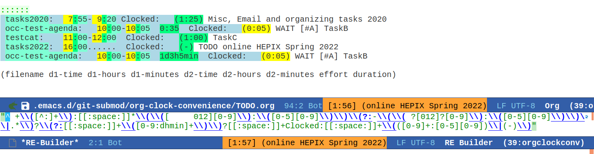

# org-clock-convenience

This is a collection of functions to make Org mode's clocking work-flow
easier.

My aim is to do as much of the clocking from the agenda buffer
without constantly leaving it for visiting the agenda org source
files, except to open a new task.

# Table of Contents

1.  [org-clock-convenience](#orgc3c4378)
2.  [Motivation](#orgb8c9e30)
3.  [Interactive functions](#orgf8c1e97)
4.  [Installation](#org5da65cb)
    1.  [basic installation and configuration](#org8bcb1f8)
    2.  [installation and configuration by **use-package**](#org0e1f4b7)
    3.  [Tip: using helm for efficiently clocking into tasks](#org6ded3c0)
5.  [Current shortcomings](#orgddaedc6)
6.  [Dealing with changes in `org-agenda-prefix-format`](#orgd602a5c)
    1.  [The problem](#org328f2c8)
    2.  [Adapting org-clock-convenience's configuration](#org984e2c6)
    3.  [Tools for checking the settings](#orgb0d9910)
    4.  [Constructing new regular expressions](#org4f9f46a)
    5.  [Keg and testing a newer org version](#org8f82e63)

# Motivation

It happens quite often that I get distracted by other tasks, e.g. a
colleague involving me in a longer discussion, while I am still
clocked in to the previous task. So, frequently I need to adapt the
clock history to fill gaps or to correct for tasks happening when I
was not in front of the screen. I want to have my whole day clocked
seamlessly, and I have done so over the last 4 years using Org.
Formerly, this involved a lot of jumping to the clock lines of org
files to adapt the timestamps, which is cumbersome and needs time.

I always wanted to have commands with which I can change the clock
values directly **from the log lines in the agenda view** in the same
way that one can change timestamps under the cursor inside of an org
file using `org-timestamp-up` and `org-timestamp-down` (usually
mapped to `<S-up>` and `<S-down>`).

# Interactive functions

-   `org-clock-convenience-timestamp-up` and `org-clock-convenience-timestamp-down`:
    When on a *clocked* line in the agenda buffer, this function will
    increase/decrease the time according to the position of the
    cursor. If the cursor is on the hour field, change the hour. If it
    is on the minutes field, change the minutes. Undo works on the
    agenda and on the source buffer.
-   `org-clock-convenience-fill-gap` modifies the timestamp at point to
    connect to the previous/next logged time range.
-   `org-clock-convenience-fill-gap-both` connects both timestamps of
    the current clock log line at point to fill the interval between
    the previous and the next clock range. The cursor need not be on a
    timestamp of the line. This is the most efficient way to fill the
    interval for a forgotten task.
-   `org-clock-convenience-goto-ts` goto the associated timestamp in the org
    file. Position the cursor respective to where the cursor was
    placed in the agenda view (e.g. on the minutes part of the
    starting time).
-   `org-clock-convenience-goto-last-clockout`: goto timestamp of the last
    clockout (this is based on a real search through the buffer and
    not based on the saved clockout value).

Note that the agenda clock changing commands work with **undo** in the
same way as other org agenda commands. They will undo in the agenda
buffer as well as in the org source buffers. But if the agenda
buffer is rebuilt after a change (e.g. by `g`), the undo information
is lost.

The package also contains a number of utility functions to associate
a list with field names with the subgroup of a regular expression and
position point at a named field or read its value.

# Installation

## basic installation and configuration

-   The package is available from [MELPA](http://melpa.org).
-   You can always install the raw package and then do
    
        (require 'org-clock-convenience)

I did not include a minor mode, since I think that these commands will be bound
in a very individual way by users. I recommend defining a setup function and
adding it to the functions run by `org-agenda-mode-hook` like here:

    (defun dfeich/org-agenda-mode-fn ()
      (define-key org-agenda-mode-map
        (kbd "<S-up>") #'org-clock-convenience-timestamp-up)
      (define-key org-agenda-mode-map
        (kbd "<S-down>") #'org-clock-convenience-timestamp-down)
      (define-key org-agenda-mode-map
        (kbd "ö") #'org-clock-convenience-fill-gap)
      (define-key org-agenda-mode-map
        (kbd "é") #'org-clock-convenience-fill-gap-both))
    (add-hook 'org-agenda-mode-hook #'dfeich/org-agenda-mode-fn)

## installation and configuration by **use-package**

If you are using John Wiegley's nice [use-package](https://github.com/jwiegley/use-package) to manage your configuration, the
configuration becomes much easier.
may want to use something like the following

    (use-package org-clock-convenience
      :ensure t
      :bind (:map org-agenda-mode-map
       	   ("<S-up>" . org-clock-convenience-timestamp-up)
       	   ("<S-down>" . org-clock-convenience-timestamp-down)
       	   ("ö" . org-clock-convenience-fill-gap)
       	   ("é" . org-clock-convenience-fill-gap-both)))

## Tip: using helm for efficiently clocking into tasks

In order not having to leave the agenda view for clocking into a
task that is not displayed in some way in the agenda view (where
you could use `I` with cursor on the task), I customize [helm](https://emacs-helm.github.io/helm/). It is
easy to just add the clocking-in as another possible action to the
`helm-org-agenda-files-headings` command:

    (defun dfeich/helm-org-clock-in (marker)
      "Clock into the item at MARKER"
      (with-current-buffer (marker-buffer marker)
        (goto-char (marker-position marker))
        (org-clock-in)))
    (eval-after-load 'helm-org
      '(nconc helm-org-headings-actions
              (list
               (cons "Clock into task" #'dfeich/helm-org-clock-in))))

Again, if you are using [use-package](https://github.com/jwiegley/use-package), you may want to include this in
the configuration (:config) stanza of `helm-config`. E.g. in my own config:

    (use-package helm-config
      :demand t
      :bind (( "<f5> <f5>" . helm-org-agenda-files-headings)
          ( "<f5> a" . helm-apropos)
          ( "<f5> A" . helm-apt)
          ( "<f5> b" . helm-buffers-list)
          ( "<f5> c" . helm-colors)
          ( "<f5> f" . helm-find-files)
          ( "<f5> i" . helm-semantic-or-imenu)
          ( "<f5> k" . helm-show-kill-ring)
          ( "<f5> K" . helm-execute-kmacro)
          ( "<f5> l" . helm-locate)
          ( "<f5> m" . helm-man-woman)
          ( "<f5> o" . helm-occur)
          ( "<f5> r" . helm-resume)
          ( "<f5> R" . helm-register)
          ( "<f5> t" . helm-top)
          ( "<f5> u" . helm-ucs)
          ( "<f5> p" . helm-list-emacs-process)
          ( "<f5> x" . helm-M-x))
      :config (progn
       	 ;; extend helm for org headings with the clock in action
       	 (defun dfeich/helm-org-clock-in (marker)
       	   "Clock into the item at MARKER"
       	   (with-current-buffer (marker-buffer marker)
       	     (goto-char (marker-position marker))
       	     (org-clock-in)))
       	 (eval-after-load 'helm-org
       	   '(nconc helm-org-headings-actions
       		   (list
       		    (cons "Clock into task" #'dfeich/helm-org-clock-in)))))
      )

# Current shortcomings

-   the calculated time span in the agenda buffer (the duration given
    in parentheses in each clock line) is only corrected after the
    user rebuilds the buffer. Since the changed fields are clearly marked by the
    temporary font, and the time span is clearly not marked, this should not
    confuse the user. I consider this secondary for the moment and will maybe
    add it at some point.

# Dealing with changes in `org-agenda-prefix-format`

## The problem

Org mode allows for full flexibility and so it is no surprise that
you also can customize the log line format for clocked times used
in the agenda view.

The format can be configured with the `org-agenda-prefix-format`
variable. This is the current default definition

    (setq org-agenda-prefix-format
          '((agenda . " %i %-12:c%?-12t% s")
        (todo . " %i %-12:c")
        (tags . " %i %-12:c")
        (search . " %i %-12:c")))

The alist element `(agenda . " %i %-12:c%?-12t% s")` defines the
clock line format.

By default, a clocked line will look like this

    testfile:    8:00- 9:00 Clocked:   (1:00) TODO TaskA

But somebody wanting to display the effort estimates as well, may
set `(agenda . " %i %-12:c%?-12t%-10e% s")` and end up with the
effort (1:00) just following the time range

    testfile:    8:00- 9:00  1:00      Clocked:   (1:00) TODO TaskA

org-clock-convenience needs to be able and parse the clocked lines,
and the parsing of the line is given by the regular expression
stored in `org-clock-convenience-clocked-agenda-re` together with a
list naming the subexpressions in
`org-clock-convenience-clocked-agenda-fields`:

    (defvar org-clock-convenience-clocked-agenda-re
      "^ +\\([^:]+\\):[[:space:]]*\\(\\([ \t012][0-9]\\):\\([0-5][0-9]\\)\\)\\(?:-\\(\\( ?[012]?[0-9]\\):\\([0-5][0-9]\\)\\)\\|.*\\)?[[:space:]]+Clocked:[[:space:]]+\\(([0-9]+:[0-5][0-9])\\|(-)\\)"
      "Regexp of a clocked time range log line in the Org agenda buffer.")
    
    (defvar org-clock-convenience-clocked-agenda-fields
      '(filename d1-time d1-hours d1-minutes d2-time d2-hours d2-minutes duration)
      "Field names corresponding to submatches of `org-clock-convenience-clocked-agenda-re'.")     

## Adapting org-clock-convenience's configuration

You need to adapt `org-clock-convenience-clocked-agenda-re` and the
field list in `org-clock-convenience-clocked-agenda-fields` and put
it into your emacs configuration.

For the functioning of org-clock-convenience only the fields
`d1-time`, `d1-hours`, `d1-minutes`, `d2-time`, `d2-hours`, and
`d2-minutes` are important.

If you change `org-agenda-prefix-format`, you need to adapt the
regular expression and the matching fieldnames. You can put it
inside your emacs configuration.

For the example above where we changed `org-agenda-prefix-format` to
contain `(agenda . " %i %-12:c%?-12t%-6e% s")`, the following
definitions will work

    (setq org-clock-convenience-clocked-agenda-re
          "^ +\\([^:]+\\):[[:space:]]*\\(\\([ \t012][0-9]\\):\\([0-5][0-9]\\)\\)\\(?:-\\(\\( ?[012]?[0-9]\\):\\([0-5][0-9]\\)\\)\\|.*\\)?\\(?:[[:space:]]+\\([0-9:dhmin]+\\)\\)?[[:space:]]+Clocked:[[:space:]]+\\(([0-9]+:[0-5][0-9])\\|(-)\\)")
    
    (setq org-clock-convenience-clocked-agenda-fields
          '(filename d1-time d1-hours d1-minutes d2-time d2-hours d2-minutes effort duration))     

## Tools for checking the settings

This repository contains testing code that allows importing new
configuration definitions and run the test suite on it, but I also
provide a make target for displaying the matches from a built
test agenda.

For this example I defined new settings in the [custom/with-effort.el](custom/with-effort.el) file
of this repository:

    (setq org-agenda-prefix-format '((agenda . " %i %-12:c%?-12t %?-10e% s")
                                     (todo . " %i %-12:c")
                                     (tags . " %i %-12:c")
                                     (search . " %i %-12:c")))
    
    (setq org-clock-convenience-clocked-agenda-re
          "^ +\\([^:]+\\):[[:space:]]*\\(\\([ \t012][0-9]\\):\\([0-5][0-9]\\)\\)\\(?:-\\(\\( ?[012]?[0-9]\\):\\([0-5][0-9]\\)\\)\\|.*\\)?\\(?:[[:space:]]+\\([0-9:dhmin]+\\)\\)?[[:space:]]+Clocked:[[:space:]]+\\(([0-9]+:[0-5][0-9])\\|(-)\\)")
    
    (setq org-clock-convenience-clocked-agenda-fields
          '(filename d1-time d1-hours d1-minutes d2-time d2-hours d2-minutes effort duration))

And now we can pass the new configuration into the test that is
executed by the `test-regx` make target by giving its location in the
`OCC_CONFIG` variable

    OCC_CONFIG=custom/with-effort.el make test-regx

    emacs --batch \
                         \
                                -l org-clock-convenience.el \
                                -l test/test-org-clock-convenience.el \
                        -l custom/with-effort.el \
                                --eval "(occ-print-all-agendaline-vals)"
    Emacs version: GNU Emacs 27.2 (build 1, x86_64-pc-linux-gnu, GTK+ Version 3.22.30)
     of 2021-08-29
    Org version: 9.4.4
    org-agenda-prefix-format set to:
    ((agenda . " %i %-12:c%?-12t %?-10e% s")
     (todo . " %i %-12:c")
     (tags . " %i %-12:c")
     (search . " %i %-12:c"))
    
    ########## GENERATED AGENDA ##########
    Day-agenda (W15):
    Friday     15 April 2022
      testfile:    8:00- 9:00  1:00      Clocked:   (1:00) TODO TaskA - State "TODO"       from              [2022-04-15 Fri 07:30]
                   8:00......  ----------------
      testfile:    9:00......  1:00      TODO TaskA
      testfile:    9:30- 9:55  1d3h5min  Clocked:   (0:25) WAIT [#A] TaskB - State "WAIT"       from "TODO"       [2022-04-15 Fri 09:50] \
      testfile:    9:50......  1d3h5min  Scheduled:  WAIT [#A] TaskB
                  10:00......  ----------------
      testcat:    11:00-12:00  Clocked:   (1:00) TaskC
                  12:00......  ----------------
                  14:00......  ----------------
                  16:00......  ----------------
                  18:00......  ----------------
                  20:00......  ----------------
    ######################################
    AGENDA_LINE:   testfile:    8:00- 9:00  1:00      Clocked:   (1:00) TODO TaskA - State "TODO"       from              [2022-04-15 Fri 07:30]
    ((filename "testfile")
     (d1-time " 8:00")
     (d1-hours " 8")
     (d1-minutes "00")
     (d2-time " 9:00")
     (d2-hours " 9")
     (d2-minutes "00")
     (effort "1:00")
     (duration "(1:00)"))
    AGENDA_LINE:   testfile:    9:30- 9:55  1d3h5min  Clocked:   (0:25) WAIT [#A] TaskB - State "WAIT"       from "TODO"       [2022-04-15 Fri 09:50] \
    ((filename "testfile")
     (d1-time " 9:30")
     (d1-hours " 9")
     (d1-minutes "30")
     (d2-time " 9:55")
     (d2-hours " 9")
     (d2-minutes "55")
     (effort "1d3h5min")
     (duration "(0:25)"))
    AGENDA_LINE:   testcat:    11:00-12:00  Clocked:   (1:00) TaskC
    ((filename "testcat")
     (d1-time "11:00")
     (d1-hours "11")
     (d1-minutes "00")
     (d2-time "12:00")
     (d2-hours "12")
     (d2-minutes "00")
     (effort nil)
     (duration "(1:00)"))
    Found 3 matching lines in the agenda

Naturally, you can also execute the test suite for checking the new
configuration

    OCC_CONFIG=custom/with-effort.el make test

    Emacs binary at /usr/local/emacs/bin/emacs
    emacs --batch \
                         \
                                -l org-clock-convenience.el \
                                -l test/test-org-clock-convenience.el \
                        -l custom/with-effort.el \
                 --eval "(princ (format \"Emacs version: %s\n\" (emacs-version)) t)" \
         --eval "(princ (format \"Org version: %s\n\" (org-version)) t)" \
                 --eval "(ert-run-tests-batch-and-exit nil)"
    
    Running 6 tests (2022-05-01 18:31:30+0200, selector ‘t’)
    
       passed  1/6  occ-test-agenda-re1 (0.318694 sec)
    
       passed  2/6  occ-test-agenda-re2 (0.021884 sec)
       passed  3/6  occ-test-clockline-re1 (0.000152 sec)
    
       passed  4/6  occ-test-fill-gap-both (0.026258 sec)
    
       passed  5/6  occ-test-timestamp-change-hours (0.006018 sec)
    
       passed  6/6  occ-test-timestamp-change-minutes (0.023669 sec)
    
    Ran 6 tests, 6 results as expected, 0 unexpected (2022-05-01 18:31:30+0200, 0.396951 sec)
    
    Emacs version: GNU Emacs 27.2 (build 1, x86_64-pc-linux-gnu, GTK+ Version 3.22.30)
     of 2021-08-29
    Org version: 9.4.4

## Constructing new regular expressions

The regular expressions are fairly complex and in order to
construct them I recommend using tools like Emacs' own
`regexp-builder` that will visualize the matches and highlight
subexpressions:

## Keg and testing a newer org version

If [keg](https://github.com/conao3/keg.el) is available for installing the test environment the make
targets will use it to install dependencies and run the commands.

I also included a keg script that will install the newest org
version available from elpa inside of the `.keg` folder. It can be
invoked like this

    keg run new-org

